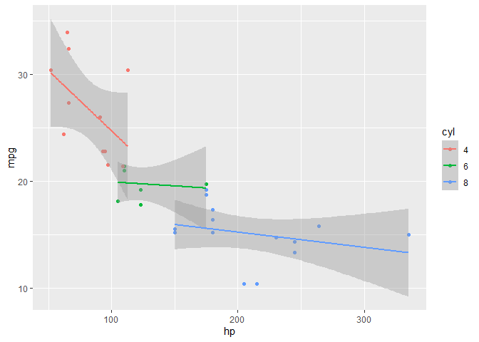

## Open Questions

1. We can't 'simply apply' methods from ML into economic problems and the main reason for that is __causality__: The heart of econometric work and economic research are usually Causality & Counterfactuals, both are absent from ML methods, as the later tend to create "Black Boxes", usually more useful for prediction rather than causality analysis (in Econometric lingo, I would say that while econometrics searches for $\beta$s, ML searches for $\hat{Y}$.

2. Usually, when we have a regression (linear or not) with the form $Y = m(X) + u$ we assume that the error term is uncorrelated with the observable ($E[Xu ] = 0$). When we use ML models, we simply don't know the regression function, let alone we don't know the error term, and it's not easy to convince ourselfs (and others) that this assumption holds.

3.  
+ __Linearity Assumption:__ This means that the outcome ($Y$) is a linear combination of some observable and parameters ($X,\beta$). The stronger hidden assumption is that the causal effect decried by the $\beta$s is constant to any value of $X$s.
+ __Separability Assumption:__ IDK...

+ __$X \sim N$ :__ involves two assumption: (1) is about the nature of distribution (symmetry to the mean, bell shape, etc.) and the second one (2) that the observable described by $X$ is generated by a process that uphold the Central Limit Theorom, allowing us to use the Normal Distrebution. 

## R, RStudio 
Already installed

## The "Tidyverse":

1. 

```r
library(tidyverse)
library(kableExtra)
```
2.

```r
data(iris)
iris %>% select(
  starts_with("sepal"),
  Species) %>%
  group_by(Species) %>% 
  summarise(Average_Sepal_Length = mean(Sepal.Length))
```

```
## # A tibble: 3 x 2
##   Species    Average_Sepal_Length
##   <fct>                     <dbl>
## 1 setosa                     5.01
## 2 versicolor                 5.94
## 3 virginica                  6.59
```

3. 

```r
data("mtcars")
mtcars %>% mutate(cyl = as_factor(cyl)) %>% 
  ggplot(
    aes(
      x = hp,
      y = mpg,
      color = cyl
    )
  ) +
  geom_point() +
  geom_smooth(method = lm)
```

```
## `geom_smooth()` using formula 'y ~ x'
```

<!-- -->

## GIT & GitHub

I open a GitHub profile due to this course and Dr. Eizenberg workshop. [this](https://github.com/zamirD123) is my profile, and this PS also has a [repository](https://github.com/zamirD123/ML4ECON_ASSIGMENT_1.git).

